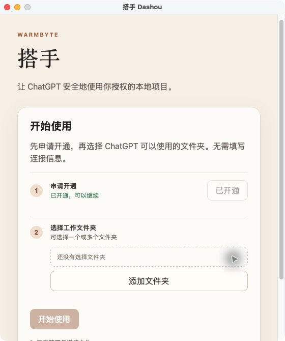
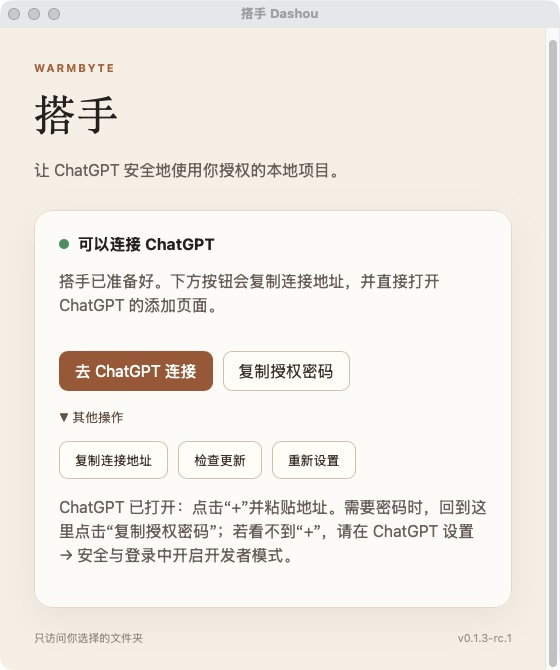
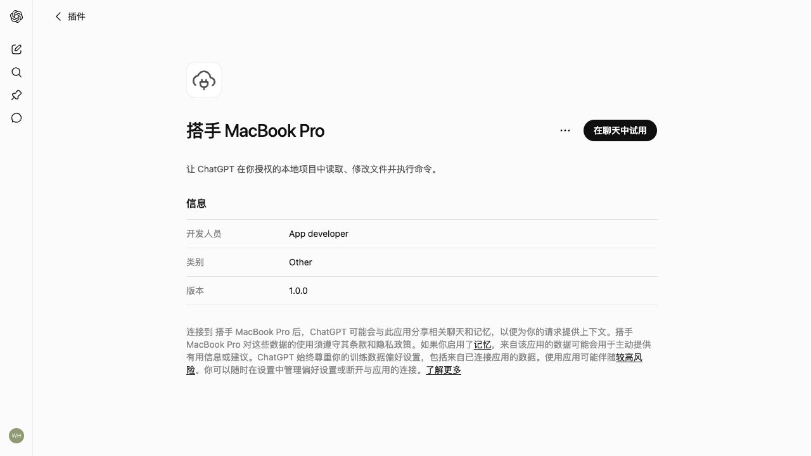

# 搭手：安装后怎么连接 ChatGPT

这份说明给第一次使用搭手的人。你不需要懂网络、进程、Node.js 或 `cloudflared`。

## 1. 下载并打开

请从 [GitHub Releases](https://github.com/winston003/dashou-releases/releases/latest) 下载与你的电脑对应的安装包：

- Mac Apple Silicon：M1 / M2 / M3 / M4
- Mac Intel：Intel 处理器的 Mac
- Windows：Windows 安装包

如果你使用的是 Mac，请先看 [macOS 免费内测版安装说明](MACOS_INSTALL.md)。第一次打开未公证的内测包时，macOS 可能会要求你对 Dashou 点右键并选择“打开”，这是一次性的系统确认。

安装后打开 **搭手 Dashou**。

## 2. 加入试用

点击 **加入试用**。页面会告诉你搭手正在确认试用名额。这一步不需要填写地址、密码或其他连接信息。

搭手准备好后，点击 **添加文件夹**，可以连续添加多个你希望 ChatGPT 使用的工作文件夹，然后点击 **开始使用**。

搭手只会让 ChatGPT 使用你在这里选择的文件夹。

## 3. 去 ChatGPT 连接

当搭手显示“可以连接 ChatGPT”时，点击 **去 ChatGPT 连接**。搭手会自动复制连接地址，并打开 ChatGPT 的插件页。

也可以直接打开这个入口：

[打开 ChatGPT 插件页](https://chatgpt.com/plugins?view=personal)

在 ChatGPT 页面：

1. 确认左侧的 **个人** 页已选中。
2. 点击页面上的 **创建应用**。
3. 选择添加自定义连接或开发者连接，并粘贴搭手复制的连接地址。
4. 如果 ChatGPT 要求密码，回到搭手点击 **复制授权密码**，再粘贴回 ChatGPT。
5. 完成 ChatGPT 自己的授权确认。

## 找不到“创建应用”怎么办？

普通用户在 ChatGPT 中按下面的路径打开开发者模式：

**头像或账户菜单 → 设置 → 应用（Apps）→ 高级设置（Advanced settings）→ 开发者模式（Developer mode）**

打开后，回到 [ChatGPT 个人插件页](https://chatgpt.com/plugins?view=personal)，再点击 **创建应用**。

如果你是工作区管理员，也可以从 **工作区设置（Workspace settings）→ 应用（Apps）→ 创建（Create）** 进入；某些工作区还需要先在 **工作区设置（Workspace settings）→ 权限与角色（Permissions & Roles）→ Connected Data** 中打开开发者模式或自定义 MCP 连接器权限。

如果你的账号或工作区没有显示这些入口，这不是搭手安装失败，而是当前 ChatGPT 账号类型或工作区策略未开放该功能；请联系工作区管理员。详细路径以 [OpenAI 官方说明](https://help.openai.com/en/articles/12584461-developer-mode-and-full-mcp-connectors-in-chatgpt) 为准。

## 关闭搭手

点击窗口左上角的关闭按钮，只会把搭手收起，不会停止连接。搭手会继续留在 macOS 顶部菜单栏；点击菜单栏里的搭手图标，可以再次打开窗口。

需要真正停止搭手时，在顶部菜单栏点搭手图标，选择 **退出搭手**。

## 第一次使用

连接完成后，直接在 ChatGPT 里说清楚你想做什么，例如：

> 请查看这个项目，告诉我最适合先修改的文件，并先不要改动。

或者：

> 在我授权的项目里新增一个 README，并告诉我你做了什么。

搭手只允许访问你选择的文件夹；ChatGPT 仍会遵守自己的确认流程。

## 最近版本变化

- 安装包内置 Node.js 和 `cloudflared`，不需要用户另行安装。
- 申请、管理员审核、连接地址和授权信息由搭手自动衔接。
- 支持选择多个工作文件夹。
- 关闭窗口后继续驻留菜单栏，只有选择“退出搭手”才停止本地服务。

如果这次没有准备好，页面会给出“重新准备”和“复制排查信息”。先重新试一次；如果仍然不行，把复制的内容发给客服即可，也可以附上页面截图。不要发送连接密码或本机日志中的敏感内容。
