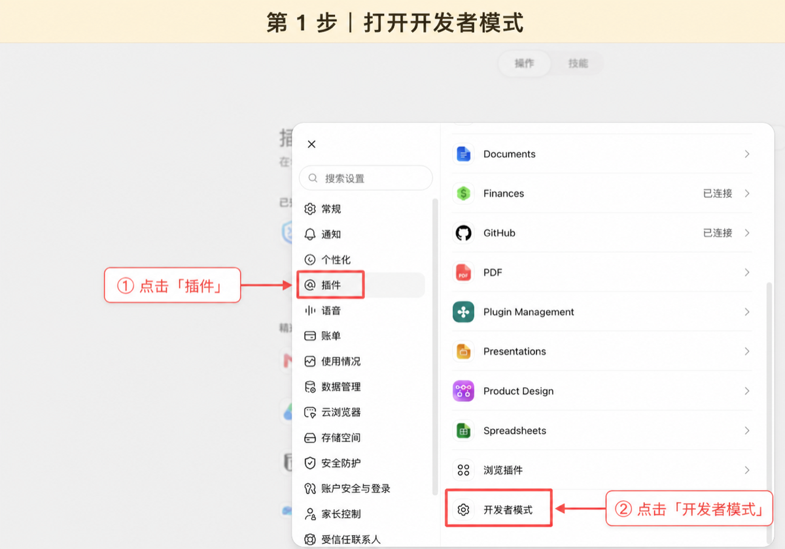
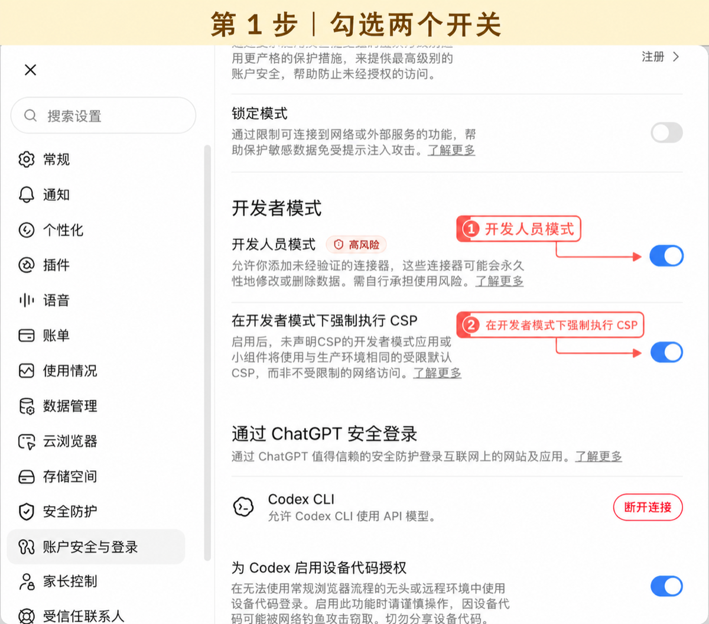

# 搭手：安装后怎么连接 ChatGPT

这份说明给第一次使用搭手的人。正常流程不需要填写网络参数，也不需要打开命令行。

## 1. 安装并准备电脑端

请使用测试联系人提供的安装包。Mac 第一次打开如果出现安全提示，请按 [Mac 安装说明](MACOS_INSTALL.md) 完成一次系统确认；不要关闭系统安全检查。

打开搭手后：

1. 点击 **开始使用搭手**；
2. 等待准备完成；
3. 选择一个或多个愿意让 ChatGPT 使用的工作文件夹；
4. 点击 **开始使用**。

## 2. 在搭手里开始连接

电脑端正常后会明确显示 **电脑端已经准备好了**，而不是提前说“ChatGPT 已连接”。


点击 **连接 ChatGPT**。搭手会自动复制这台电脑的连接地址，并打开 ChatGPT 插件页。

## 3. 跟着 1/3 → 2/3 → 3/3 操作

### 1/3 打开开发者模式

在 ChatGPT 打开：

**设置 → 插件 → 开发者模式**



勾选 **开发人员模式** 和 **在开发者模式下强制执行 CSP**。



### 2/3 创建搭手

搭手把名称、描述和当前电脑的服务器 URL 放在同一页，每一项都能直接复制。


在 ChatGPT 插件页点击 **+** 或 **创建应用**：

- 名称：`搭手`
- 描述：`让我在授权的本地工作区中工作`
- 连接方式：`服务器 URL`
- 服务器 URL：从搭手复制
- 身份验证：`OAuth`


### 3/3 完成授权

浏览器出现搭手授权页后：

1. 回到搭手；
2. 点击 **复制授权密码**；
3. 回到浏览器粘贴；
4. 点击 **允许连接**。


新版授权页会在密码输入框上方直接显示这四步，不需要用户在几个页面之间猜。

## 4. 完成第一个只读任务

只有检测到 OAuth 完成和 ChatGPT 会话后，客户端才会显示 **ChatGPT 已连接**。


点击 **复制任务并打开 ChatGPT**，发送：

```text
请列出我选择的项目，并告诉我每个项目是做什么的。先不要修改文件。
```

第一次工具调用成功后，客户端才会显示 **搭手已经可以干活了**。

## 5. 安全边界

- 文件读取和修改仅限你选择的文件夹；
- 项目命令默认关闭；主动开启后会使用当前电脑账户的权限，但不会继承搭手或云端凭据。搭手不是完整的系统沙箱；
- 不要把连接地址或授权密码发到群聊、Issue 或公开网页；
- 关闭窗口只会把搭手收起，真正停止时从菜单栏或系统托盘选择 **退出搭手**。

## 卡住时

打开 **设置 → 搭手排查卡 → 复制排查信息**，把当前截图、排查信息和卡住的步骤发给测试联系人。排查信息会标明电脑端、授权、ChatGPT 会话和首次工具分别进行到哪一步，但不包含密码、连接凭据、目录路径、文件内容或 ChatGPT 对话。
